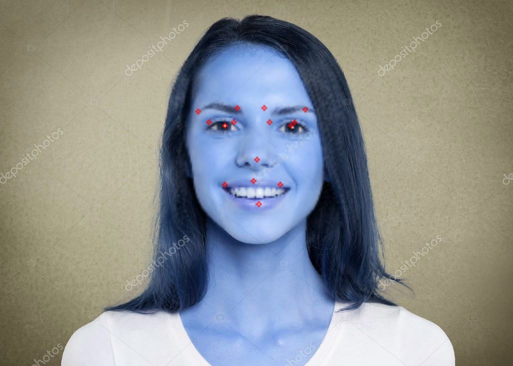

## Facial Landmark Detection Using CNN
*"Facial landmark detection is the task of detecting key landmarks on the face and tracking them (being robust to rigid and non-rigid facial deformations due to head movements and facial expressions)"*


## Main Idea
- Image --> CNN --> output co-ordinates of the landmarks
- [Explained by Andrew Ng](https://www.youtube.com/watch?v=rRB9iymNy1w)
- further see ``facial-keypoints.ipynb`` for seeing the training process and network architechture


## Dataset
- [Data](https://www.kaggle.com/drgilermo/face-images-with-marked-landmark-points)

## To Run
- ```image.py``` runs the network on any image
- ```vedio.py``` runs the network on vedio from web cam


## Output

- Image Output
-  


- Vedio Output
- 

## TODO
- Better image processing in vedio
- Better dataset ( or clean this one)
    - Data contains only some images with 15 landmarks , rest contain only 4
